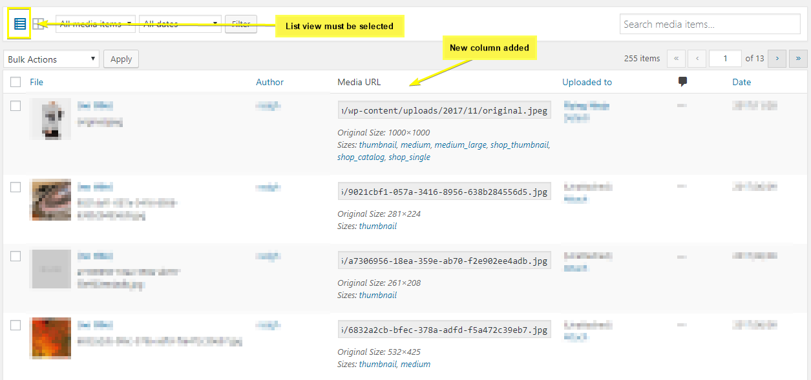

RS Image Sizes Media Column
==

_Adds a column to the Media screen which shows the media URL and all generated sizes for every image._

    Contributors: radgh
    Donate link: https://paypal.me/radgh
    Tags: social networks, sharing buttons
    Requires at least: 3.2
    Tested up to: 4.9.6
    Stable tag: 1.0.0
    License: GPLv3
    License URI: http://www.gnu.org/licenses/gpl-3.0.html

## Description ##

This plugin simply adds a new informational column to the "Media" screen. You must set the screen to "List" view. The column displays the media URL for each copy/paste, original size, and a list of all generated thumbnail sizes as direct links.

## Installation ##

1. Upload the plugin files to `/wp-content/plugins/rs-image-sizes-media-column/`.
2. Activate the plugin.
3. Go to the media screen and change to list view using the icon near the top-left.
3. See the new "Media URL" column.

## Frequently Asked Questions ##

None yet

## Screenshots ##

## Changelog ##

#### 1.0
* First release